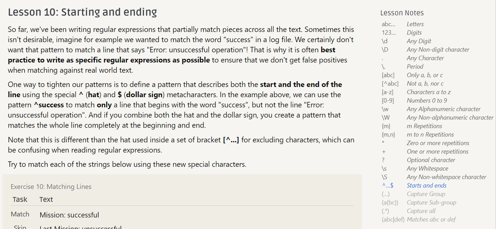
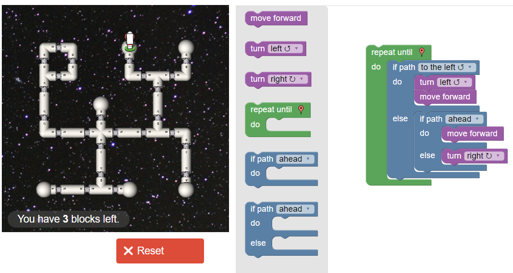

c) #2:

One additional tip for providing useful answers is to *use simple and understandable language*; much fuss is given about not being vague when asking questions, but it's equally true when answering them. A repl no one else can read is a useless one.
Another important tip is to *be specific*; telling someone to that they have a problem in a certain function, for instance, is much less helpful than pointing out the exact line causing the problem.

#3:

The main takeaway from the reading is that our current legal system is not sufficiently modernized in all cases.
Clearly Jordan had no intent to pirate music or break copyright laws; the only music he could access was music one could easily find anyway.
Despite only making an existing system easier to use, however, Jordan was faulted as if he were intentionally creating and distributing pirated files, and then forced to give effectively the entirety of his savings over in compensation. 
It should be obvious, then, that this sequence of events represents an *exploitation* of the law, not an intended usage, in order to control data which was already freely available.
Therefore, I believe it to be apparent that our current intellectual propety laws need to be updated for the twenty-first century, in order to prevent them from being abused like in scenarios such as this.

d) #3:

e) #2:

#3:

f) #1:

g) #paragraph on potentially interesting OS project

